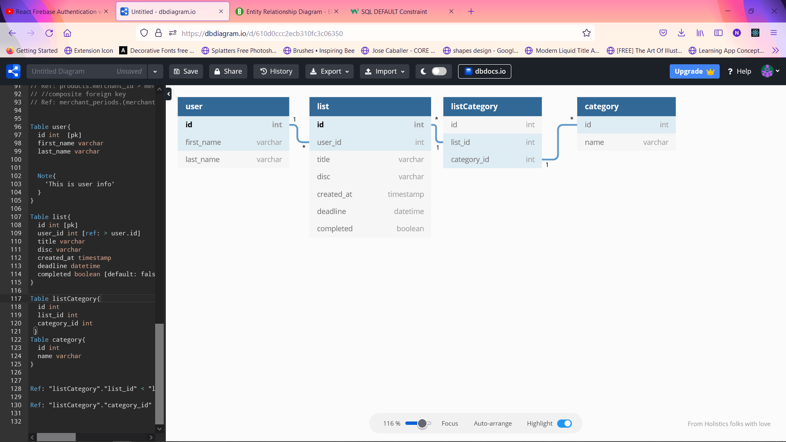

able user{
id int [pk]
first_name varchar
last_name varchar

Note{
'This is user info'
}
}

Table list{
id int [pk]
user_id int [ref: > user.id]
title varchar
disc varchar
created_at timestamp
deadline datetime
completed boolean [default: false]
}

Table listCategory{
id int
list_id int
category_id int
}
Table category{
id int
name varchar
}

Ref: "listCategory"."list_id" < "list"."id"

Ref: "listCategory"."category_id" < "category"."id"

