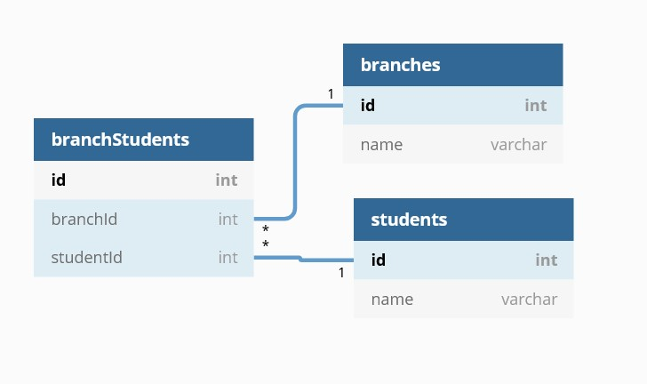
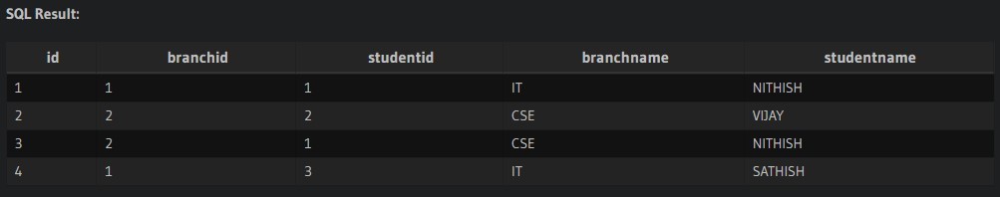

Table branchStudents{
  id int [pk]
  branchId int 
  studentId int
}

Table branches{
  id int [pk]
  name varchar 
}

Table students{
  id int [pk]
  name varchar
}

Ref: "branches"."id" < "branchStudents"."branchId"

Ref: "students"."id" < "branchStudents"."studentId"

